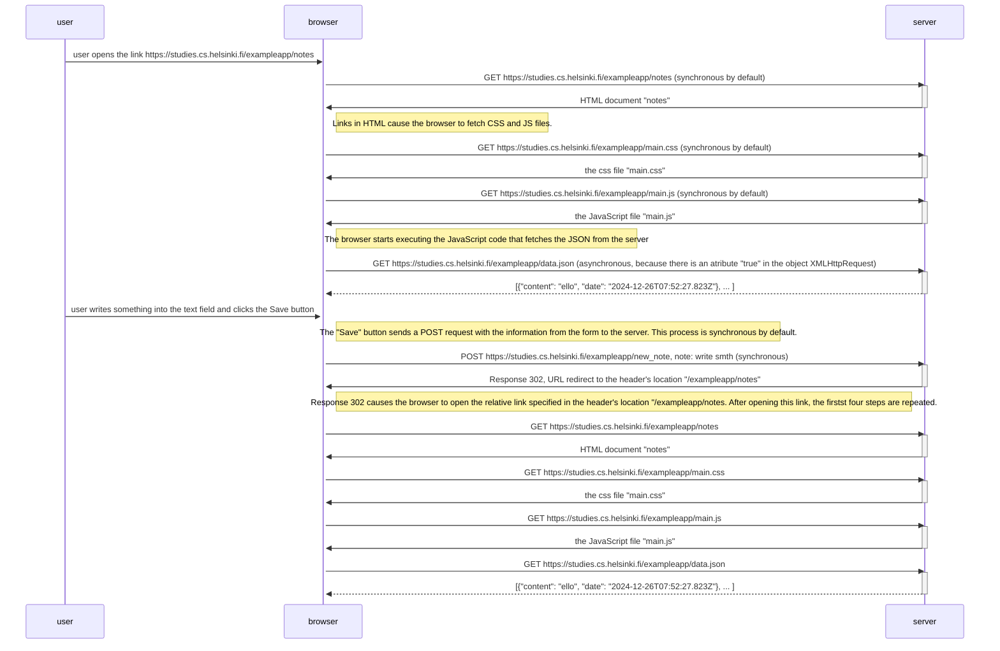

```mermaid
sequenceDiagram
    participant user
    participant browser
    participant server

    user->>browser: user opens the link https://studies.cs.helsinki.fi/exampleapp/notes
    activate browser
    
    browser->>server: GET https://studies.cs.helsinki.fi/exampleapp/notes (synchronous by default)
    activate server
    server->>browser: HTML document "notes"
    deactivate server
    
    Note right of browser: Links in HTML cause the browser to fetch CSS and JS files.
    
    browser->>server: GET https://studies.cs.helsinki.fi/exampleapp/main.css (synchronous by default)
    activate server
    server->>browser: the css file "main.css"
    deactivate server

    browser->>server: GET https://studies.cs.helsinki.fi/exampleapp/main.js (synchronous by default)
    activate server
    server->>browser: the JavaScript file "main.js"
    deactivate server

    Note right of browser: The browser starts executing the JavaScript code that fetches the JSON from the server

    browser->>server: GET https://studies.cs.helsinki.fi/exampleapp/data.json (asynchronous, because there is an atribute "true" in the object  XMLHttpRequest)
    activate server
    server-->>browser: [{"content": "ello", "date": "2024-12-26T07:52:27.823Z"}, ... ]
    deactivate server

    user->>browser: user writes something into the text field and clicks the Save button
    
    Note right of browser: The "Save" button sends a POST request with the information from the form to the server. This process is synchronous by default.

    browser->>server: POST https://studies.cs.helsinki.fi/exampleapp/new_note, note: write smth (synchronous)
    activate server
    server->>browser: Response 302, URL redirect to the header's location "/exampleapp/notes"
    deactivate server

    Note right of browser: Response 302 causes the browser to open the relative link specified in the header's location "/exampleapp/notes. After opening this link, the firstst four steps are repeated.

    browser->>server: GET https://studies.cs.helsinki.fi/exampleapp/notes
    activate server
    server->>browser: HTML document "notes"
    deactivate server
    
    browser->>server: GET https://studies.cs.helsinki.fi/exampleapp/main.css
    activate server
    server->>browser: the css file "main.css"
    deactivate server
    
    browser->>server: GET https://studies.cs.helsinki.fi/exampleapp/main.js
    activate server
    server->>browser: the JavaScript file "main.js"
    deactivate server

    browser->>server: GET https://studies.cs.helsinki.fi/exampleapp/data.json
    activate server
    server-->>browser: [{"content": "ello", "date": "2024-12-26T07:52:27.823Z"}, ... ]
    deactivate server

```