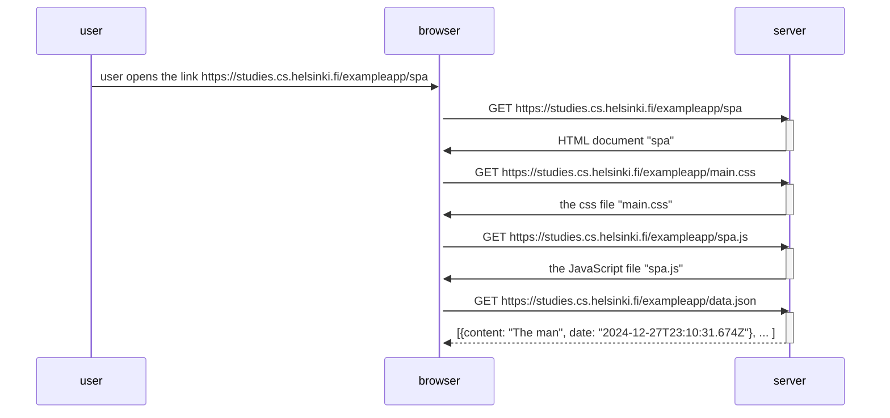

```mermaid
sequenceDiagram
    participant user
    participant browser
    participant server

    user->>browser: user opens the link https://studies.cs.helsinki.fi/exampleapp/spa
    activate browser
    
    browser->>server: GET https://studies.cs.helsinki.fi/exampleapp/spa
    activate server
    server->>browser: HTML document "spa"
    deactivate server
    
    browser->>server: GET https://studies.cs.helsinki.fi/exampleapp/main.css
    activate server
    server->>browser: the css file "main.css"
    deactivate server

    browser->>server: GET https://studies.cs.helsinki.fi/exampleapp/spa.js
    activate server
    server->>browser: the JavaScript file "spa.js"
    deactivate server

    browser->>server: GET https://studies.cs.helsinki.fi/exampleapp/data.json
    activate server
    server-->>browser: [{content: "The man", date: "2024-12-27T23:10:31.674Z"}, ... ]
    deactivate server

```