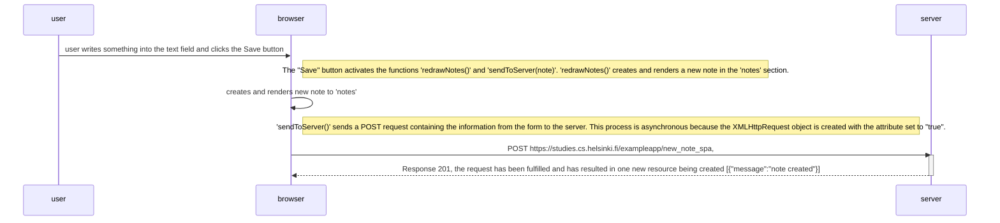

```mermaid
sequenceDiagram
    participant user
    participant browser
    participant server

    user->>browser: user writes something into the text field and clicks the Save button
    
    Note right of browser: The "Save" button activates the functions 'redrawNotes()' and 'sendToServer(note)'. 'redrawNotes()' creates and renders a new note in the 'notes' section. 

    browser ->> browser: creates and renders new note to 'notes'

    Note right of browser: 'sendToServer()' sends a POST request containing the information from the form to the server. This process is asynchronous because the XMLHttpRequest object is created with the attribute set to "true".
    browser->>server: POST https://studies.cs.helsinki.fi/exampleapp/new_note_spa, 
    
    activate server
    server-->>browser: Response 201, the request has been fulfilled and has resulted in one new resource being created [{"message":"note created"}]
    deactivate server


```